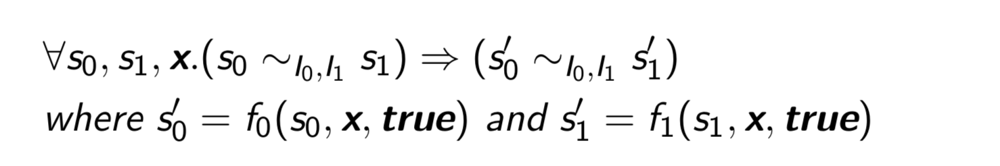
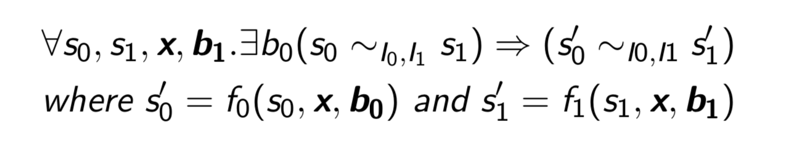
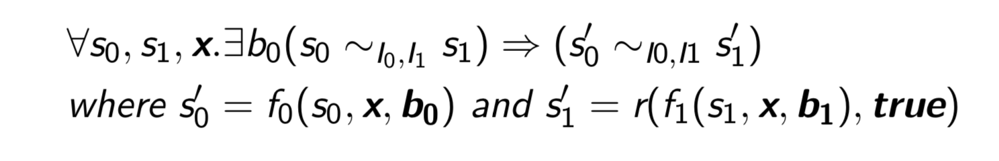
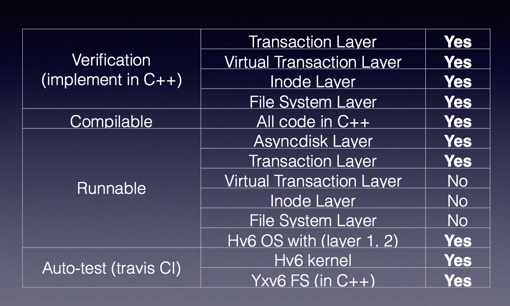
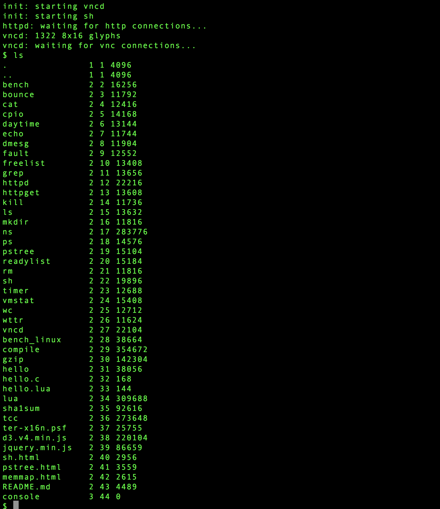
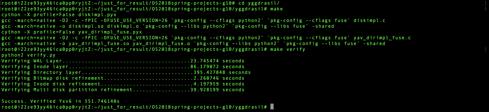
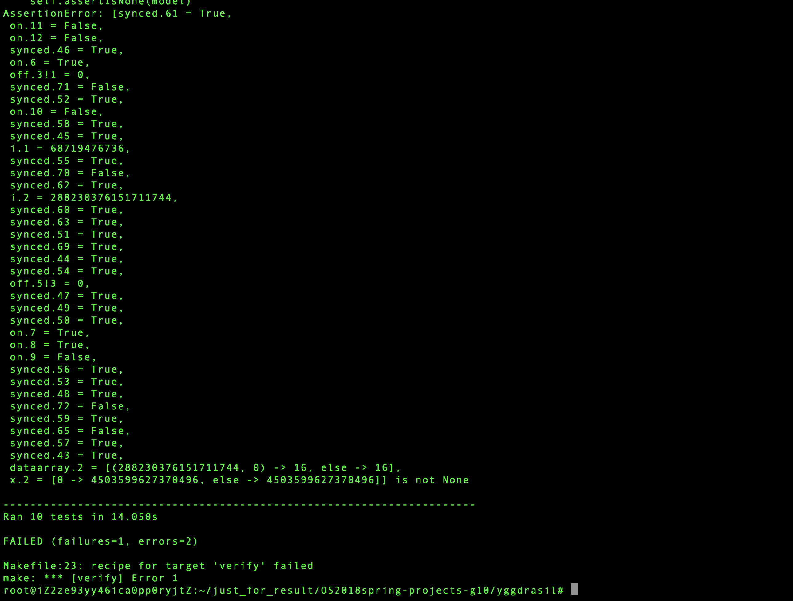

# 操作系统 大实验 g10 Verification of File Systems 最终报告

							2015011358，陈经基
							2015011347，朱昊


<!-- vim-markdown-toc GFM -->

* [引言](#引言)
* [任务介绍](#任务介绍)
	* [掉电安全文件系统介绍](#掉电安全文件系统介绍)
	* [Crash-Refinement的形式化定义](#crash-refinement的形式化定义)
		* [Definition 1](#definition-1)
		* [Definition 2](#definition-2)
		* [Definition 3](#definition-3)
		* [Definition 4](#definition-4)
		* [Definition 5](#definition-5)
		* [Definition 6](#definition-6)
	* [掉电文件系统开发流程](#掉电文件系统开发流程)
* [Yggdrasil代码介绍与分析](#yggdrasil代码介绍与分析)
	* [环境设置](#环境设置)
	* [符号执行引擎](#符号执行引擎)
* [hv6 FS分析与介绍](#hv6-fs分析与介绍)
	* [LLVMPy Emitter](#llvmpy-emitter)
* [工作计划](#工作计划)
* [14-16周完成的工作](#14-16周完成的工作)
	* [工作简述](#工作简述)
	* [实验环境配置](#实验环境配置)
		* [seasnake编译器配置](#seasnake编译器配置)
		* [docker的配置(hv6与其他工具环境配置)与使用](#docker的配置hv6与其他工具环境配置与使用)
	* [Yxv6文件系统从python到C++的移植工作](#yxv6文件系统从python到c的移植工作)
		* [整体移植思路](#整体移植思路)
		* [WALDisk类 (Transaction层)](#waldisk类-transaction层)
			* [简要介绍](#简要介绍)
			* [移植细节](#移植细节)
		* [InodeDisk类, IndirectInodeDisk类 (VirtualTransaction层，Inode层)](#inodedisk类-indirectinodedisk类-virtualtransaction层inode层)
			* [简要介绍](#简要介绍-1)
			* [移植细节](#移植细节-1)
		* [DirImpl类 (File System层)](#dirimpl类-file-system层)
			* [简要介绍](#简要介绍-2)
			* [移植细节](#移植细节-2)
		* [BitmapDisk类（VirtualTransaction层）](#bitmapdisk类virtualtransaction层)
			* [简要介绍](#简要介绍-3)
			* [移植细节](#移植细节-3)
		* [InodePack类](#inodepack类)
			* [简要介绍](#简要介绍-4)
			* [移植细节](#移植细节-4)
		* [Partition类](#partition类)
			* [简要介绍](#简要介绍-5)
			* [移植细节](#移植细节-5)
	* [将移植到C++的Yxv文件系统接入hv6操作系统](#将移植到c的yxv文件系统接入hv6操作系统)
		* [整体思路](#整体思路)
		* [C与C++的混合编译](#c与c的混合编译)
			* [通常情况下的混合编译方法](#通常情况下的混合编译方法)
			* [C语言与C++语言的标准不同带来的问题](#c语言与c语言的标准不同带来的问题)
		* [AsyncDisk Layer](#asyncdisk-layer)
		* [Transaction Layer (WALDisk类）](#transaction-layer-waldisk类)
	* [实验结果展示](#实验结果展示)
		* [hv6运行与验证](#hv6运行与验证)
		* [移植到C++的Yxv6文件系统的验证](#移植到c的yxv6文件系统的验证)
			* [正常验证结果](#正常验证结果)
			* [构造带有bug的文件系统实现的验证结果](#构造带有bug的文件系统实现的验证结果)
	* [任务分工](#任务分工)
	* [实验结论与收获](#实验结论与收获)
	* [代码文件说明](#代码文件说明)
	* [致谢](#致谢)
* [参考文献](#参考文献)

<!-- vim-markdown-toc -->

## 引言
文件系统是操作系统的一个不可缺少的组成成分。而硬盘上的数据结构非常复杂，进行验证与复现bug比较困难。在这个工作中，我们讨论如何写出并验证一个crash-safe的文件系统。

之前的文献 (Sigurbjarnarson et al., 2016) 中已经提及一个crash-safe的文件系统Yggdrasil，然而这个文件系统使用Python写成，尽管在使用中可以很容易地转换成C语言，但是仍然不是一个操作系统中的有机的组成成分。和它形成鲜明对比的是，我们将考虑验证一个真实操作系统中的文件系统。我们将展示如何在一个C语言写成的操作系统中，使用C++语言完成文件系统中的主要分层，并对其进行验证。

再进一步，我们将考虑在一个内核安全的操作系统 (Nelson et al., 2017) 中对于文件系统进行验证。和他们不同的是，他们对于文件系统的处理略显粗暴，将文件系统直接放在用户态而并不加以验证。而我们将直接对于文件系统的crash safety进行验证。

这个工作的贡献主要有以下的几个方面：
1. 据我们所知，我们首次提出同时验证一个操作系统的内核安全性和文件系统的掉电安全性；
2. 我们提供了验证C++写成的文件系统的完整工具链条。
3. 我们在实验中证明了我们的文件系统确实可以防止一部分掉电漏洞，并能给出反例。

## 任务介绍
接下来对本次大实验中所需要完成的实验任务进行简要介绍：

在本次实验中，我们最主要的工作在于对Yggdrasil这一用于验证掉电安全的文件系统的框架的代码与论文分别进行分析与理解，并且对代码进行注释，并且得到分析文档；其次对hv6操作系统的文件系统进行分析与理解，并且得到分析文档；在完成了足够的分析了解之后，将Yggdrasil中验证的使用cython实现的fuse文件系统Yxv6fs移植到使用C实现的hv6文件系统中，并且使用hv6中原先使用的符号执行框架，与Yggdrasil中进行掉电安全性验证的部分连接起来，从而使得hv6操作系统中拥有一个掉电安全的文件系统。

### 掉电安全文件系统介绍

Nelson et al. (2017) 使用了crash refinement作为了文件系统掉电安全性的形式化定义；在该形式化定义下，如果要验证某一个文件系统的掉电安全性，首先需要一份本身就应当被认为是安全的规范设置，称为specification，以及在每一个特定的磁盘状态下应当满足的不变量（表示为一阶谓词逻辑定理）；在拥有了specification的情况下，要求在当前文件系统实现在任何出现系统崩溃并且之后正确地执行了回复程序recovery之后的情况下，磁盘所处的状态与必须与某一个specification中执行了同一操作之后到达的状态等价（之所以说是某个状态，是因为认为specification中能够通过操作和系统奔溃的组合能够到达的所有状态都是合法的，因此特定一个specification中到达的状态，经过指定的某一次操作之后，能够到达的状态并不一定只有一个）；如果所有实现能够达到的磁盘状态均与specification能够达到的某状态想等价，则认为这个文件系统的实现是关于这个specification掉电安全的。

### Crash-Refinement的形式化定义

在下文中将对crash-refinement进行形式化定义：

#### Definition 1

在确定掉电安全性之前，首先需要的是所实现的文件系统能够符合规范的要求，因此需要要求在没有发生任何系统奔溃的情况下，文件系统的实现所能够到达的状态应该是specification中所允许的，因此，要求对于implement中的某一个状态s1与其对应的等价的specification中的状态s0，在执行完指定操作f之后，在发生掉电安全的情况下，他们所到达的状态仍然应当是等价的。

因此，形式化地描述在不发生系统奔溃情况下，实现能够符合规范要求的情况如下：

假设，f0是规范中描述的操作，而f1是实现中描述的操作，而他们所对应的系统不变量分别为I0, I1，则认为f1是在不掉电的情况下符合f0的要求（称之为f0与f1 crash-free equivalent）需要满足如下条件：



#### Definition 2

接下来描述在不具有recovery操作的情况下，在考虑了系统奔溃的可能下的情况下，需要怎样要求才能够认为实现满足规范的要求：由于所有允许的状态都是在规范中执行相应操作能够到达的状态，因此如果在实现中执行某一个操作，并且遭遇或者没有遭遇到系统奔溃的过程，最终到达的状态仍然能够与规范中允许的某一个状态想等价，则认为是实现本身还是符合了规范的要求；
因此，形式化地定义在考虑了系统奔溃的可能性，并且不考虑存在recovery操作的情况下，实现能够符合规范要求的情况如下：

假设，f0是规范中描述的操作，而f1是实现中描述的操作，而他们所对应的系统不变量分别为I0, I1，则认为f1在上述情况下符合f0的要求（称之为f1是f0的一个crash-refinement without recovery）需要满足如下条件：



#### Definition 3

由于在文件系统中，很有可能因为系统的奔溃，导致磁盘上维护的数据结构出现了不一致的情况，因此不少文件系统会在奔溃之后的其中的时候启动恢复操作，尝试恢复磁盘上文件系统的不一致性，这样的话文件系统的recovery操作使得文件系统的实现要符合规范的要求要更加简单一些，即不需要强硬的要求实现中执行完某一个操作，并且考虑了奔溃的情况下到达的状态一定需要与规范中要求的状态等价就可以了，而是只需要到达的状态在通过恢复操作之后可能到达与规范中的某个状态相等价的状态即可；自然，恢复操作的过程中也可能经历掉电的过程，在这种情况下，掉电这种情况显然不能够影响后续重启的时候执行的恢复操作的正确执行，因此，只要存在一次恢复操作成功了，就能够修复磁盘的不一致状态。

将上述性质称为了恢复操作的幂等性，将其进行形式化定义如下：

假设r是一个恢复函数，则其满足幂等性需要满足以下条件：


#### Definition 4

接下来讨论在存在恢复操作的情况下，实现能够符合规范的要求需要满足的形式化条件如下所示：

假设f0是规范中定义的某一个操作，而f1是实现中定义的与f0相对应的操作，而I0，I1分别是指这两个操作所需要满足的系统不变量，而r是幂等的恢复操作，而f0,f1本身在不考虑系统奔溃的情况下是等价的，则f1是满足了f0要求的实现（记为f1是f0的一个crash-refinement），则需要还满足的条件有：



#### Definition 5

由于存在某些操作不会对磁盘状态造成影响，因此对这些操作进行形式化定义如下：


#### Definition 6

接下来将文件系统F定义为文件系统的操作f的集合，则认为文件系统的实现F1满足了规范F0需要满足F1中所有的操作f1都满足了F0中对应的操作f0的要求；

### 掉电文件系统开发流程

接下来介绍开发掉电安全的文件系统的开发流程：

1. 编写文件系统需要满足的规范；
2. 编写需要满足的条件不变式；
3. 编写文件系统的实现；
4. 验证文件系统的实现满足规范；
5. 对文件系统的实现进行优化；

## Yggdrasil代码介绍与分析

### 环境设置

接下来简要介绍Yggdrasil和hv6的环境配置：

配置Yggdrasil环境：

1.  安装Z3
2.  安装fuse头文件，否则无法通过pkg-config正确获取相应的cflags
3.  创建文件系统的磁盘镜像
4.  创建fuse文件系统的挂载点（设置为a）
5.  编译yggdrasil
6.  挂载文件系统
7.  进行验证

配置hv6环境：

1. 安装qemu;
2. 更新编译工具;
3. 此时已经可以使用qemu运行hv6操作系统了;
4. 由于hv6原先实在ubuntu 17.10上编写的，使用的编译环境版本较高，使用make verify验证的时候有可能无法通过，因此需要对代码进行部分修改;
5. 使用make verify进行验证了;

最后环境配置成docker image，并且存放在docker hub上，分别为amadeuschan/osproject, amadeuschan/osproject_with_hv6，前者适用于yggdrasil中文件系统的验证与运行，而后者适用于两者的验证与运行；

此外，还在travis CI上配置了自动测试，由于travis CI默认需要10min内至少有一次对stdout的显式输出，而在yggdrasil中，某些test需要的时间要略长于10min，因此实现了后台脚本每隔10min往stdout输出的方式来欺骗travis CI平台，从而使得能够正确地完成测试。

### 符号执行引擎
Yggdrasil中的符号执行引擎使用了Z3， 符号化执行引擎的作用为对于将函数的返回值与输入值的关系表达成计算图。符号化执行引擎支持指定的输入类型，如定长的BitVec（用来代替int，short等类型），Function（提供输入对输出的映射）等。

在Yggdrasil中，Z3还被用来验证一系列一阶谓词逻辑表达式，也即作为SMT solver使用。像我们前面所说的，约束本身会被实现为一个自动机，而实现通过Z3的符号执行也会产生一个自动机，两个自动机的某些state应当具有等价性（也即前面所说的Def 1-6），我们将这些等价性的与的取反作为一阶谓词逻辑输入Z3 solver中就可以进行验证，如果存在成立条件，表明存在掉电情况下不符合crash-safe定义的情况。同时Z3支持对于可满足的情况给出满足的解，在这个框架中也就是crash unsafe的情况。如果不存在成立条件，也就是说在任何情况下都不存在似的掉电不安全的解，也即掉电安全。

## hv6 FS分析与介绍

1. 该文件系统共分为7层，从下向上分别为：
   1. Disk
   2. Buffer cache
   3. logging
   4. inode
   5. directory
   6. pathname
   7. file descriptor

其中各层向上层提供的服务主要为：
   1. Disk: iderw，提供了往物理磁盘的指定扇区读写数据的功能（根据后文中xv6的实现，猜测该接口实现的服务为原子操作）；
   2. buffer cache: 维护了一系列物理磁盘上的某些扇区在内存里的备份，其中每一个扇区只能有一个备份，每一个备份只能由一个进程占有；具体提供的接口有：
      1. pread: 返回指定扇区在内存中的备份；
      2. pwrite: 将对内存中磁盘扇区备份的修改写入物理磁盘；
      3. prelse: 当前进程释放对当前持有的某个buffer的占用；
   3. logging: logging层为文件系统提供了具有原子性的写若干个block的服务，称为transaction，其实现方式为，在磁盘上的某一特定区域维护一个log分区，其中log分区包括了分区头以及若干数量的用于存储要写入内容的block；具体实现原子性的做法为：在要进行对若干个block的写操作的时候，将这些需要一起进行的写操作分别写入到log分区中，在完成了对log分区的写操作之后，将分区头中需要写的block的数量置为非零；之后再进行对磁盘对应区域的写操作；如果当前文件系统crash了，在重启之后，执行recovery操作，首先会检查log分区头中是否需要写的block数量为零，如果不是则完成log分区中记录的所有写操作；一旦完成了所有写操作，再将分区头的计数置为0；这样的话就可以保证原子性了：如果在写入log分区，还没有修改计数为非零的时候crash，recovery的时候则完全不会考虑到这若干写操作，则这个transaction完全不会发生；而如果在写入log分区之后，还没有完成对磁盘的所有写操作之前crash，恢复操作会考虑到log中还有没有完成的写操作，会重新进行整个transaction的写操作；如果在完成所有写操作并且修改了分区头的计数为0之后，则已经完成了整个transaction的写操作；综上，可以发现，只要保证对某一个block的写的原子性，则可以保证整个transaction的写的原子性；具体本层提供的接口有：
       1. begin_op: 开始一个transaction;
       2. log_write: 往log中写入对某一个block的写操作；
       3. write_head: 修改log分区头；
       4. install_trans: 将log分区中的所有修改写入磁盘；
       5. end_op: 结束一个transaction；
       6. recover_from_log: 在crash之后进行恢复操作；
   4. inode: 提供了对磁盘上与内存中的inode一系列管理接口，包括对指定inode的第指定个数据块的读取和写入操作，使用上一层的transaction保证操作的原子性；
   5. directory: 认为目录是一种特殊的文件，其数据块中存储了一系列该目录下的文件名和inode信息；
   6. pathname: 使用文件路径名寻找到对应innode；
   7. file descriptor：便于将其他接口（dev等）抽象成文件；


### LLVMPy Emitter
这一部分文档较长，请见Wiki [PyEmitter](https://github.com/oscourse-tsinghua/OS2018spring-projects-g10/wiki/PyEmitter)。

## 工作计划 
1. 将hv6FS的代码做irpy产生符号化执行图
2. 将1.中的执行图在Yggdrasil中做验证（难点）
3. 将Yggdrasil的FS port到hv6中（难点）
4. 验证新写出的FS代码

## 14-16周完成的工作

### 工作简述

接下来先简要介绍在14周展示到第16周最终展示这两周内完成的工作，如下文所示：

在本段时间里主要完成的工作是将经过验证的，使用python语言完成的Yxv6文件系统移植到C++中，并且使用c++到python的编译器seasnake来建立起将C++的文件系统实现转化成python代码，之后在原先的文件系统验证框架中进行验证这一流程，使得保证C++实现的文件系统本身是掉电安全的；此外，还尝试将C++完成的文件系统实际接入hv6操作系统中，使其能够为hv6操作系统提供服务，最终实现结果为成功将移植到C++的文件系统中的两层接入到hv6操作系统中，并且使得该操作系统可以成功运行。此外，还在开发过程中使用持续集成工具travis CI进行自动测试，来保证移植过程中，移植结果的正确性。

下表将直观地说明本段时间工作的内容:



### 实验环境配置

接下来说明实验环境的配置方法。

#### seasnake编译器配置

首先说明seasnake编译器的配置方法，根据seasnake代码仓库中的自动测试脚本travis.yml可知或者其环境配置方法，具体如下（Ubuntu 16.04操作系统中）:

- sudo apt-get update -y
- sudo apt-get install libclang-3.6 clang-3.6 -y
- 如果发现缺少库lz，则需要安装: sudo apt-get install zlib1g-dev
- 如果缺少库lcurses，则需要安装：sudo apt-get install libncurses5-dev
- git clone https://github.com/pybee/seasnake.git
- export LD_LIBRARY_PATH=/usr/lib/llvm-3.6/lib
- export LLVM_HOME=/usr/lib/llvm-3.6
- cd seasnake
- pip install .

至此配置完成了seasnake编译工具所需要使用的系统环境，如果需要使用seasnake工具，可以使用如下命令：

- seasnake -s WALDisk.cc WALDisk.h diskimpl.h 

表示编译WALDisk.cc中的内容到python，其中\*.为依赖的头文件；

#### docker的配置(hv6与其他工具环境配置)与使用

接下来简要介绍docker的配置与使用，在前文中已经介绍过了yggdrasil与seasnake的环境配置方法，因此在本处不再赘述，在本次课程设计中，所使用的用于持续集成开发以及日常开发使用的docker image的是使用ubuntu 16.04的image配置而成的，接下来将简要介绍在已经配置好了seasnake, yggdrasil的环境中配置hv6环境的方法(参考了group 9在ubuntu 17.10上的配置工作)：

- 安装qemu;
	- wget https://download.qemu.org/qemu-2.10.1.tar.xz
	- tar xvJf qemu-2.10.1.tar.xz
	- cd qemu-2.10.1
	- sudo apt-get install automake && apt-get install libtool && sudo apt install pkg-config libglib2.0-dev
	- ./configure
	- make && sudo make install
- 更新编译工具；
	- sudo apt-get upgrade build-essential
	- sudo apt-get upgrade g++
- 此时已经可以使用qemu运行hv6操作系统了：
	- make
	- make qemu
- 由于hv6原先实在ubuntu 17.10上编写的，使用的编译环境版本较高，使用make verify验证的时候有可能无法通过，因此需要对代码进行部分修改：
	- 在irpy/compiler/PyLLVMEmitter.cc文件开头加上，#define _GLIBCXX_USE_CXX11_ABI 1；
	- 在irpy/compiler/PyLLVMEmitter.cc中，形如{"inbounds", "True"}的代码一律修改成std::tuple<std::string, std::string>{"inbounds", "True"}（前者是高版本C++的一个新特性）；
- 完成了上述操作之后，便可以使用make verify进行验证了;

至此介绍完成了所有环境配置工作，完成了所有环境配置工作的docker image被push到docker hub上，供需要使用，如果需要使用，可使用以下命令获取image：

- docker pull amadeuschan/osproject

### Yxv6文件系统从python到C++的移植工作

接下来将介绍将Yxv6文件系统从python语言移植到C++语言实现的移植工作；

#### 整体移植思路

首先介绍整体的移植思路：

由于hv6操作系统是使用C进行编写的，如果要使得hv6操作系统上运行Yxv6这一掉电安全的文件系统，最直观的思路就是使用C++/C将python实现的Yxvfs重写一遍，然后为了保证C++实现的正确性，使用某种手段将C++代码编译成python的可以符号执行的代码，然后将编译出来的python代码接入到yggdrasil的验证框架中进行验证，从而保证最终接入到hv6操作系统中的新的文件系统本身的核心逻辑是掉电安全的。

在这个基本思路中，面临的基本挑战以及其解决方案分别有:

- 先将C++代码编译成LLVM IR中间代码，然后使用IRPY emiteer工具将IR编译成python；这种思路的优缺点分别如下所示
	- 优点：可以重复使用Irpy的代码（HyperKernel中）。Irpy从llvm ir编码出发可以更本质地验证操作系统。
	- 缺点：
- 上述思路是hv6进行安全性验证的基本思路，但是由于上述提及到的种种缺点，最终使得我们放弃了使用irpy编译器来完成C++代码到python代码的转化，因此我们另寻思路，希望能够找到一个C++到python之间更加方便的编译器，最终我们选择了seasnake编译器，这是github上的一个开源项目，其主要优缺点如下所示：
	- 优点：

		- 该编译器对C++中的面向对象编程的思路是友好的，也就是说，在通过了编译器的编译之后，C++中的类的基本结构仍然能够顺利地转化为python代码中的类的基本结构，而不像在LLVM IR中，没有对面向对象编程的结果保留；
		- 该编译器编译得到的结果具有着高度的可读性，其中包括其保留了基本的代码结构以及对变量名的保留；
		- 该编译器直观，方便上手使用；
	- 缺点：
		- 该编译器仅仅支持C++语言的一个子集，有些C++的语言特性没法使用，比如说C++中的lambda表达式；
		- 该编译器不像LLVM clang一样被广泛使用，也就是说不排除编译过程中会出现比较显著的bug，但是我们认为在本课程设计中，作为一个示范性的项目而不是一个实际工程中使用的项目，使用这么一个编译器已经足够了，如果在实际工程中使用，可能需要自己重写该编译器，或者对该编译器进行修改与完善，使其可以通过足够多的压力测试，可靠性具有了足够的保障才行；

- 另外一个基本的挑战在于，C++的语言特性与python的语言特性中具有不重合的地方，也就是说原先的python实现的文件系统中，可能使用到了一些python中特有的语言特性，这使得难以之间将其翻译成C++代码，比如说list，lambda expression, named tuple等语言特性，这就需要我们在移植的过程中，首先将python实现中所有跟python相关的语言特性提取出来，然后将其进行封装，并且在C++中对这些封装的类也进行具有着相同功能的实现（事实上就是胶水代码），通过上述封装操作之后，python文件系统的核心逻辑都适用于直接移植到C++，然后再使用C++语言对这些核心逻辑重写；

因此可以总结整个移植过程中的基本思路为：

- 选择合适的C++ to python编译器；
- 将原先python文件系统实现中关于python语言特性的部分提取出来，同时需要适当地对验证框架进行修改，使得最终修改后的python实现仍然能够通过掉电安全性验证；
- 将修改后的文件系统python实现移植到C++；
- 编写脚本，利用编译工具将C++的文件系统实现编译成python实现，并且进行验证；

下文中将具体介绍在移植每一个类的时候的移植细节；

#### WALDisk类 (Transaction层)

##### 简要介绍

首先简要介绍WALDisk类的作用，其对应到了文件系统中的Transaction层，其基本作用为保证在每一对begin_tx, commit_tx之间的所有write操作整体体现出原子性，这些write操作的集合被称之为一个transaction，一个transaction中的所有write操作要么都被写到disk上了，要不就都没有被写到disk上了，该原子性利用了一个额外的log分区来实现，基本思路为，在开始一个transaction的时候，将所有的write操作都暂时地记录到log分区上，然后直到结束一个transaction的时候，再将分区的第一个block里面的一个计数器从原先的0修改成write操作的数量，然后再从log分区中读取write操作的数据，将其写到数据分区中区，知道所有write操作都正确地写进了数据分区，才修改log分区的计数器，将其修改成0；如果在写入数据分区的过程中，反正了磁盘奔溃的操作，那么在下次重启的时候，将执行磁盘恢复操作，这时候会检查log分区中是否计数器非零，如果非零的话，将log分区中的所有write操作再重新写入数据分区，这就最终保证了整个transaction的原子性；

##### 移植细节

接下来简要介绍移植细节：

在移植过程中遇到的主要困难就在于python实现中使用到的python语言特性，包括如下内容：

- 首先是python中的list数据类型，在C++中没有list这一基本数据类型，如果使用STL中类似功能的模板数据结构的话，seasnake又不支持将其翻译成python代码，因此需要对所有使用到list的部分进行封装：
	- 在WALDisk中，使用list用于存储(dev, bid, data)这一三元组，因此考虑将其封装成一个TripleList类；
	- 在WALDisk中，使用list用于存储数据磁盘的（PartitionAsyncDisk），因此考虑将其封装成PartitionAsyncDiskList类；
- 其次还有使用到了Dict类，因此考虑根据dict中存储的内容，封装成CacheDict类；
- 其次在验证框架中有可能对上述类的对象使用中括号运算符，for遍历对象中的元素，使用len函数获取对象中元素的个数等，因此分别需要实现这些封装后的类中的如下接口：
	- \_\_setitem\_\_
	- \_\_getitem\_\_
	- \_\_iter\_\_
	- \_\_len\_\_
	- next
	- append

#### InodeDisk类, IndirectInodeDisk类 (VirtualTransaction层，Inode层)

##### 简要介绍

首先简要介绍一下这两个类的功能，其分别对应到了论文中文件系统结构的VirtualTransaction层，Inode层，前者将原先Transaction Layer支持的32位寻址扩展到64位寻址，而后者就是一般的文件系统中用于维护Inode信息的层；

##### 移植细节

接下来介绍在移植InodeDisk，IndirectInodeDisk类中的python相关的语言特性：

- lambda表达式；在InodeDisk中使用lambda表达式来构造函数，使用类将其封装起来，将lambda表达式中需要的参数传入类的构造函数，之后调用类中设置的相应函数即可；
- named tuple: 事实上是一个规定了类中的method名字，但是具体定义需要在构造的时候将method的具体定义作为参数传入的一种语法糖，考虑将其封装成特定的类，然后在其中定义好具有相同名字的类方法即可；
- 将类型作为参数传入给函数，这个语言的使用是由于在yggdrasil中由于一段代码同时需要用于形式化验证以及用于编译成实际可以运行的文件系统，因此对于特定的某一层，需要将外层究竟是spec的类还是impl的类传入，但是由于在我们移植后的框架中，python部分代码仅仅用于形式化验证，也就是说python中（除了废弃的代码）就只有spec，而所有impl都是使用C++实现的，因此不会有混淆的问题，因此只需要硬编码好类的名字即可，不需要使用如此迂回的方式；
= 此外遇到的其他语言特性在先前的移植工作中已经遇到过了，此处不再赘述；

#### DirImpl类 (File System层)

##### 简要介绍

接下来介绍最后一层，文件系统层，其基本功能是提供文件系统对外暴露的功能，包括根据路径名寻找对应的inode，创建目录，移除目录等；

##### 移植细节

接下来介绍在DirImpl层中遇到的python相关的语言特性；

- 函数具有多个返回值，需要将多个返回值封装成一个类，然后函数返回这个类的对象即可；
- 此外遇到的其他语言特性在先前的移植工作中已经遇到过了，此处不再赘述；

#### BitmapDisk类（VirtualTransaction层）
BitmapDisk是VirtualTransaction层的一部分，它对于每一个block只存储一个bit，这种操作对于SMT推理进行了简化，当然也浪费了磁盘空间。根据 (Sigurbjarnarson et al., 2016) 中所言，我们可以使用一个packed bitmap来代替每个block只存储一个bit的BitmapDisk，也即bitmap中的第n个bit被存储在第n个block的最低位。另一方面，一个packed bitmap disk 在每一个block中存储了4KB × 8 = 2^15 bits，第n个bit被存储在第n/2^15个block的第n mod 2^15位。这明显地表明，packed bitmap是前面提到的稀疏存储的一个crash refinement。

这个类是文件系统的一部分，这个类实现了对于文件系统中单bit的操作——修改和读取。其基本作用是保证对于单bit读写的原子性。

##### 简要介绍
在test bitmap的过程中，我们主要验证在写入和读取单bit的过程中的安全性。

##### 移植细节
BitmapDisk中主要需要实现三个函数is_set，set_bit和unset_bit。这三个函数的主要实现方法类似，均接受一个bit作为输入，这个bit的高49位表明了block的标号，中9位表明了block中的域（field），第6位表明了bit的标号。获得了这个bit的位置之后我们就可以实现读取、设成1、设成0三种操作。

#### InodePack类
和Bitmap类类似，为了简化SMT求解，我们实际使用了Packed inode的实现，也就是说，我们验证的是一个硬盘上多个不重合分区，来作为多个硬盘的一个crash refinement。由于使用一个硬盘可以显著地减少状态数，SMT的求解将会更加快速。

正像(Sigurbjarnarson et al., 2016) 中的定理6讲的，一个异步磁盘上的不重合分区，使用packed bitmap和inodes，是使用多个硬盘的crash refinement。

##### 简要介绍
在test Inodepack的过程中，我们主要验证在写入和读取meta和映射信息的过程中的安全性。

##### 移植细节
InodePackDisk中主要需要实现五个函数：read，set_iattr, get_iattr, set_mapping和get_mapping。需要额外实现Stat类，来存储meta信息，如大小，修改时间，模式，链接数等。

#### Partition类
Partition类比较简单，需要实现控制磁盘上分区的功能。

##### 简要介绍
像我们前面所说的Yggdrasil中文件系统使用了多分区来作为多硬盘的crash refinement，Partition就是用来实现多分区功能的。

##### 移植细节
Partition中的读写就是硬盘的读写，当然为了实现分区，我们对于输入的地址需要做判断，判断是否超出了本分区。

### 将移植到C++的Yxv文件系统接入hv6操作系统

#### 整体思路
在验证过程中，我们没有实现AsyncDisk类，而在C++文件系统中，我们需要实现该类作为一个模拟的磁盘驱动器，并能实现分区管理。为了验证现实世界的C++文件系统确实能够经过我们进行crash safety的验证，我们替换了原来的log层为我们的waldisk层进行验证。

#### C与C++的混合编译
在一般情况下C/C++的混合编译还算比较容易。我们可以把C语言的代码和C++语言的代码都编译成.o文件，之后进行链接。但是在一个复杂的C语言操作系统中的混合编译，就会比较麻烦了。为了后面的方便，我们使用了clang++==3.8.0作为编译器，因为它能够根据文件的后缀名使用不同的编译器。
##### 通常情况下的混合编译方法
通常情况下，在C语言调用C++语言的函数时，我们可以使用`extern "C"` 来包裹C++函数。而C++语言调用C语言函数的时候，需要使用`extern "C"` 来包裹需要调用的函数对应的头文件。这样就实现了相互调用。一个比较头疼的问题是，C++语言中的类与C语言中struct并不完全对应。这个问题的解决办法是把这个类的struct形式（C语言）定义成这个类的名字，比如`typedef struct AsyncDisk AsyncDisk;` 这样就可以让C语言和C++语言使用同样的代码来定义这个类的对象（结构体的实例）了。然而这里又出现一个问题，我们在定义一个类的对象时不能使用操作系统提供给我们的服务，比如new一个新的对象，因此要使用malloc（我们的操作系统中实现的）函数来分配对象的内存。
##### C语言与C++语言的标准不同带来的问题
前文提到了，我们会使用hv6OS中的已经实现好的malloc函数。除去malloc之外，还有很多的函数和类型定义是需要使用hv6OS中本来的定义的。这些函数的实现固然可以用C语言编译器变成.o之后直接使用，然而其声明和一部分实现却出现在了头文件中。这些头文件中有诸多不符合C++语言规范的语法，使用include之后进行编译时会出现问题。

解决的办法是使用`__cplusplus` 宏来处理。我们可以从一层层引用的文件中挑出来我们需要的那些声明，然后使用`#ifndef __cplusplus ... #endif` 来包裹其余部分。

#### AsyncDisk Layer
AsyncDisk Layer与原来hv6OS实现的不同在于AsyncDisk对于不同分区进行了封装，因此需要在原来的整块硬盘（使用内存模拟）上分开不同的区域。在访问时添加对于边界的检查，防止修改其他分区。

#### Transaction Layer (WALDisk类）
原来hv6OS中的log层与WALDisk类的实现基本一致，只是面向过程的语言与封装起来的代码不太一样。因此，需要实现原来log层的`initlog`，`logwrite` ，`begin_op` 和`end_op` 的接口。由于原来hv6FS中的锁本质上不存在，所有对于锁的实现都是空函数，因此`begin_op` 和`end_op` 本质上没有任何意义，我们只需要实现`initlog`，`logwrite`即可。`initlog`就对应了WALDisk中的构造函数，而`logwrite`则对应了WALDisk里面的write函数。
### 实验结果展示

#### hv6运行与验证


运行方法：`cd hv6; make; make qemu`

#### 移植到C++的Yxv6文件系统的验证

验证方法:`cd yggdrasil; make verify`

##### 正常验证结果

接下来显示在实现没有问题下的正常验证通过结果:



##### 构造带有bug的文件系统实现的验证结果

接下来修改原先掉电安全的文件系统实现，使得实现中存在bug，借此来验证本文件系统验证框架是否能够正确找出bug；修改的代码如下所示：修改的内容为删除掉所显示代码中的第一个flush操作，即将其注释掉，之后再对该文件系统进行验证，得到的结果如下所示;

```c++
void WALDisk::writev(TripleList *iov) {
	// ......

	_logdisk->write(LOG_DEV_HEADER_BLOCK, hdr_dev1);
	_logdisk->write(LOG_DEV_HEADER_BLOCK + 1, hdr_dev2);
	_logdisk->write(LOG_BID_HEADER_BLOCK + 1, hdr_bid2);
	
	//_logdisk->flush(); if this flush is deleted, the FS is not carsh-safe.
	_logdisk->write(LOG_BID_HEADER_BLOCK, hdr_bid1);
	_logdisk->flush();

	for (uint64_t i = 0; i < iov_len; ++ i) {
		uint64_t dev = iov->get_dev(i);
		uint64_t bid = iov->get_bid(i);
		Block *data = iov->get_data(i);
		_datadisks->__getitem__(dev)->write(bid, data);
	}
	__commit();
}

```



根据上述结果可以知道，最终验证框架找到了该bug，并且得出了文件系统实现不是掉电安全的结论；

解释上述注释掉第一个flush会对文件系统的掉电安全性造成破坏的原因：

上述代码来自于write-ahead logging disk，使用了典型的logging文件系统来保证一个transaction操作的原子性，其基本思路为首先将所有的write操作都写到log分区中，然后修改分区的第一个block的计数器，暂时将整个transaction保存下来，然后再进行写操作，所有写操作完成之后再将计数器清零，如果FS崩溃重启，则会发现log分区的计数器非零，则会开始重写log分区中保存的write操作，这样就保证了原子性。但是如果在没能确保write操作的所有数据都到达了disk上就贸然修改了计数器，则会使得最终可能出现计数器非零，但是所有write的数据还没有写入disk上（在cache上）就FS崩溃的情况，这就使得之后的恢复操作变得不可能，这就出现了一个bug，因此验证没法通过；

### 任务分工

以下将说明在本次课程设计中，本小组的两位成员的任务分工：

- 陈经基

	* 相关文献阅读与分析，主要包括
		* yggdrasil论文
		* xv6文档
		* 其他资料，比如与符号执行相关的tutorial
	* 环境配置
		* 适用于yggdrasil, hv6，以及seasnake工具的docker配置
		* travis CI上的自动测试配置（朱昊同学也使用了另一种方法完成了travis CI的配置）
	* 项目代码分析
	* seasnake工具的学习与了解
	* python到C++的文件系统主体部分的移植，包括如下部分:
		- WALDisk (Transaction Layer)
		- InodeDisk, IndirectInodeDisk (Virtual Transaction Layer, Inode Layer)
		- DirImpl (File System Layer)
		- 部分胶水代码
	* 部分实验文档，展示slide等

- 朱昊
	* 相关文献阅读与分析，主要包括
		* yggdrasil论文
		* xv6文档
		* 其他资料，比如与符号执行相关的tutorial
	* 环境配置
		* 适用于yggdrasil, hv6，以及seasnake工具的docker配置
		* travis CI上的自动测试配置（陈经基同学也使用了另一种方法完成了travis CI的配置）
	* 项目代码分析
	* seasnake工具的学习与了解
	* Irpy的学习和封装，实现了和Yggdrasil的融合。提供的使用样例见Wiki [Symbolic Execution for C Codes](https://github.com/oscourse-tsinghua/OS2018spring-projects-g10/wiki/Symbolic-Execution-for-C-Codes)。最终证明了该方法不是最优方法，使用seasnake代替了该方法。
	* python到C++的文件系统上三层的移植，包括如下部分:
		- Bimap (VirtualTransaction Layer)
		- InodePack (Inodes Layer)
		- Partition类（分区管理）
	* 融合C++文件系统与hv6OS
		 * AsyncDisk的实现 
		 * WalDisk Layer的移植和胶水代码
	* 部分实验文档，展示slide等


### 实验结论与收获

### 代码文件说明
`yggdrasil` 下是我们改造的Yggdrasil文件系统的验证代码，其中`yggdrasil/yggdrasil` 是融合了irpy的Yggdrail验证代码，`hv6` 文件夹下是我们改造的hv6OS操作系统。`yxv6fs` 是我们的CPP实现文件系统。

### 致谢
* 感谢陈渝教授，向勇教授，张强学长，秦岳同学，陈宇同学，王曦教授
* 感谢seasnake包的贡献者

## 参考文献

* Sigurbjarnarson, Helgi, et al. "Push-Button Verification of File Systems via Crash Refinement." OSDI. Vol. 16. 2016.
* Nelson, Luke, et al. "Hyperkernel: Push-Button Verification of an OS Kernel." Proceedings of the 26th Symposium on Operating Systems Principles. ACM, 2017.
* Joshi, Rajeev, and Gerard J. Holzmann. "A mini challenge: Build a verifiable filesystem." In Verified Software: Theories, Tools, Experiments, pp. 49-56. Springer, Berlin, Heidelberg, 2008.
* Chen, Haogang, Tej Chajed, Alex Konradi, Stephanie Wang, Atalay İleri, Adam Chlipala, M. Frans Kaashoek, and Nickolai Zeldovich. "Verifying a high-performance crash-safe file system using a tree specification." In Proceedings of the 26th Symposium on Operating Systems Principles, pp. 270-286. ACM, 2017.
* T. S. Pillai, V. Chidambaram, R. Alagappan, S. AlKiswany, A. C. Arpaci-Dusseau, and R. H. ArpaciDusseau. All file systems are not created equal: On the complexity of crafting crash-consistent applications. In Proceedings of the 11th Symposium on Operating Systems Design and Implementation (OSDI), pages 433–448, Broomfield, CO, Oct. 2014.
